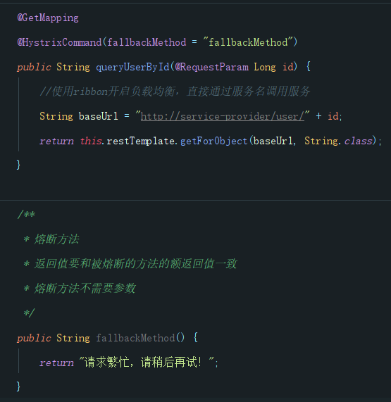

# springcloudstudy
Spring Cloud学习
## Hystrix
Hystrix,英文意思是豪猪，全身是刺，看起来就不好惹，是一种保护机制。  
主页：https://github.com/Netflix/Hystrix/  
Hystix是Netflix开源的一个延迟和容错库，用于隔离访问远程服务、第三方库，防止出现级联失败。  

Hystix解决雪崩问题的手段有两个：
- 服务降级，线程隔离
- 服务熔断

在pom.xml中引入依赖
```xml
<dependency>  
     <groupId>org.springframework.cloud</groupId>  
     <artifactId>spring-cloud-starter-netflix-hystrix</artifactId>  
 </dependency>
 ```

### 服务降级

1. 在主类上添加`@EnableCircuitBreaker`开启熔断
2. 编写降级方法，并在需要降级的方法上添加`@HystrixCommand(fallbackMethod = "fallbackMethod")`
    降级方法与需要被降级的方法的返回值要一样。  
      
    另外，在此也可以在类上声明一个默认的降级方法，在类上使用注解`@DefaultProperties(defaultFallback = "fallbackMethod")`可以为类中所有方法指定默认降级方法，在需要降级的方法上添加`@HystrixCommand`即可。
    - @DefaultProperties(defaultFallback = "defaultFallBack")：在类上指明统一的失败降级方法
    - @HystrixCommand：在方法上直接使用该注解，使用默认的降级方法。
    - defaultFallback：默认降级方法，不用任何参数，以匹配更多方法，但是返回值一定一致
3. Hystrix的默认超时时间为1秒钟，通过在application.yml配置`hystrix.command.default.execution.isolation.thread.timeoutInMilliseconds`可以指定超时时间，超时未响应也会触发降级（即执行降级方法）。
```yaml
hystrix:
  command:
    default:
      execution:
        isolation:
          thread:
            timeoutInMilliseconds: 6000 # 设置hystrix的超时时间为6000ms
```
### 服务熔断
熔断有三个状态： 
* Closed： 关闭状态，所有请求正常访问
* Open: 打开状态，所有请求均被降级，Hystrix对请求次数进行记录，若失败比例达到50%或请求失败次数超过20次，则触发熔断。
* Half Open：半开状态，当Open状态被触发后，默认5秒后断路器会自动进入half Open状态，此时释放部分请求，若这些请求均通过，则会将状态调整为close，否则再次回到open状态重新计时。

    
